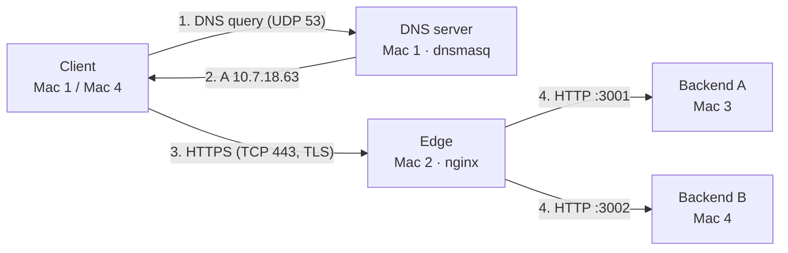

# Private Network Service Platform: Team Newbugs

Computer Networks course project. A private service environment built on four MacBooks on one Wi-Fi LAN, with no cloud services.

**Core principle:** the application stays simple; the network is the project.

A client opens `https://app.newbugs.test`. The name is resolved by our own DNS server, the HTTPS connection terminates at our own nginx edge, and each request is load-balanced across two backend servers.



Full architecture, diagrams, protocol mapping and test results: [`docs/ARCHITECTURE.md`](docs/ARCHITECTURE.md)

## Team and machine roles

| Mac | Owner | Role | IPv4 | Services |
| --- | --- | --- | --- | --- |
| Mac 1 | Shivam | Private DNS server + test client | 10.7.17.246 | dnsmasq on 53/UDP, 53/TCP |
| Mac 2 | Divya | Edge: reverse proxy, TLS termination, load balancer | 10.7.18.63 | nginx on 80 (redirect), 443 (HTTPS, HTTP/2) |
| Mac 3 | Manjeet | Backend A | 10.7.2.214 | Flask REST API on 3001 |
| Mac 4 | Khushi | Backend B + test client | 10.7.18.116 | Flask REST API on 3002 |

Network: campus Wi-Fi, subnet 10.7.0.0/19, gateway 10.7.0.1. Private domain: `newbugs.test`.

> **IPs come from DHCP and can change.** At the start of every session, run `ipconfig getifaddr en0` on all four Macs. If Mac 2's IP changed, update the `host-record` lines in `dns/dnsmasq.conf`. If a backend's IP changed, update the `upstream` block in `edge/newbugs.conf`.

## Repo layout

```
docs/       ARCHITECTURE.md: topology, inventory, request flow, protocol layers, test results
dns/        dnsmasq.conf (Mac 1)
edge/       newbugs.conf (nginx, Mac 2), server.ext, newbugs-ca.crt (public CA certificate only)
backend/    app.py and requirements.txt (Mac 3 and Mac 4 run the same file)
scripts/    helper scripts
evidence/   screenshots and Wireshark captures, one folder per task
```

## Prerequisites

All Macs on the same Wi-Fi network, with **Private Wi-Fi Address turned off** (System Settings → Wi-Fi → Details) so each Mac keeps a stable address.

```bash
# Homebrew: https://brew.sh
brew install --cask wireshark      # every Mac
brew install dnsmasq bind          # Mac 1
brew install nginx openssl@3       # Mac 2
python3 --version                  # Mac 3 and Mac 4: 3.9 or newer
```

## Start-up order

Start the backends first, then the edge, then DNS, then test from a client.

### Mac 3 and Mac 4: backends

```bash
cd backend
python3 -m venv venv
source venv/bin/activate
pip install -r requirements.txt

BACKEND_ID=A PORT=3001 python app.py    # Mac 3
BACKEND_ID=B PORT=3002 python app.py    # Mac 4
```

Leave this terminal open. Allow incoming connections for Python if macOS asks. Check with `lsof -nP -iTCP:3001 -sTCP:LISTEN`, which should show `*:3001`.

| Endpoint | Purpose | Cache headers |
| --- | --- | --- |
| `GET /` | Service running page | none |
| `GET /api/status` | Load-balancing proof via `X-Backend: A` / `B` | `no-store` |
| `GET /api/catalog` | Caching demo (fresh hit and 304) | `max-age=60` + `ETag` |

### Mac 2: edge (nginx + TLS)

Create the certificates once (see [TLS setup](#tls-setup)), then:

```bash
NGX="$(brew --prefix)/etc/nginx"
mkdir -p $NGX/certs
cp app.newbugs.test.crt app.newbugs.test.key $NGX/certs/
cp edge/newbugs.conf $NGX/servers/

sudo nginx -t
sudo brew services start nginx
sudo lsof -nP -iTCP -sTCP:LISTEN | grep nginx    # expect *:80 and *:443
```

After any config change: `sudo nginx -t && sudo nginx -s reload`

### Mac 1: DNS (dnsmasq)

```bash
cp dns/dnsmasq.conf "$(brew --prefix)/etc/dnsmasq.conf"
$(brew --prefix)/sbin/dnsmasq --test --conf-file=$(brew --prefix)/etc/dnsmasq.conf
sudo brew services start dnsmasq
dig @127.0.0.1 app.newbugs.test       # expect A 10.7.18.63, TTL 60
```

After any config change: `sudo brew services restart dnsmasq`

### Client Macs: use our DNS and trust our CA

```bash
# Mac 1 uses itself; Mac 4 uses Mac 1
sudo networksetup -setdnsservers Wi-Fi 127.0.0.1        # Mac 1
sudo networksetup -setdnsservers Wi-Fi 10.7.17.246      # Mac 4
sudo dscacheutil -flushcache; sudo killall -HUP mDNSResponder

# Trust the team CA (public certificate only)
sudo security add-trusted-cert -d -r trustRoot \
  -k /Library/Keychains/System.keychain edge/newbugs-ca.crt
```

To undo the DNS change: `sudo networksetup -setdnsservers Wi-Fi Empty`

## Testing

Run from a client Mac. No `-k` flag: certificates are fully validated.

```bash
# DNS
dig app.newbugs.test

# Full path: DNS, TCP, TLS, HTTP
curl -v "https://app.newbugs.test/api/status"

# Load balancing: should alternate A and B
for i in 1 2 3 4 5 6; do curl -s "https://app.newbugs.test/api/status"; echo; done

# HTTP/2
curl -sI --http2 "https://app.newbugs.test/" | head -1

# Caching: 200 with ETag, then 304 with the same ETag
curl -sI "https://app.newbugs.test/api/catalog"
curl -sI -H 'If-None-Match: "e946e9046cad3704"' "https://app.newbugs.test/api/catalog"
```

On Mac 2, the access log shows which backend served each request:

```bash
sudo tail -f /opt/homebrew/var/log/nginx/newbugs_access.log
```

## TLS setup

Run once on Mac 2 with OpenSSL 3. The CA private key never leaves Mac 2 and is never committed.

```bash
OSSL="$(brew --prefix openssl@3)/bin/openssl"
mkdir -p ~/cn-project/certs && cd ~/cn-project/certs

# 1. Local certificate authority
$OSSL genrsa -out newbugs-ca.key 4096
$OSSL req -x509 -new -key newbugs-ca.key -sha256 -days 365 -out newbugs-ca.crt \
  -subj "/CN=Newbugs Local CA" \
  -addext "basicConstraints=critical,CA:TRUE" \
  -addext "keyUsage=critical,keyCertSign,cRLSign"

# 2. Server key and signing request
$OSSL genrsa -out app.newbugs.test.key 2048
$OSSL req -new -key app.newbugs.test.key -out app.newbugs.test.csr -subj "/CN=app.newbugs.test"

# 3. CA signs the server certificate, using edge/server.ext (SAN for app and api)
$OSSL x509 -req -in app.newbugs.test.csr -CA newbugs-ca.crt -CAkey newbugs-ca.key \
  -CAcreateserial -out app.newbugs.test.crt -days 365 -sha256 -extfile server.ext

# 4. Verify
$OSSL verify -CAfile newbugs-ca.crt app.newbugs.test.crt    # app.newbugs.test.crt: OK
```

## Failure demonstrations (Phase 1)

| # | Failure | How to trigger | Expected result |
| --- | --- | --- | --- |
| F1 | Wrong DNS server on a client | `sudo networksetup -setdnsservers Wi-Fi 8.8.8.8` | `NXDOMAIN`, curl exit 6; `ping 10.7.18.63` still works |
| F2 | DNS record points to the wrong IP | Change `app` `host-record` to 10.7.2.214, restart dnsmasq | `dig` succeeds, curl gets `Connection refused` on 443 |
| F3 | One backend stopped | Ctrl+C on Mac 3 | All requests still 200 from Backend B; nginx logs the failover |
| F4 | Both backends stopped | Ctrl+C on Mac 3 and Mac 4 | TLS verifies, then `HTTP/2 502` from nginx |
| F5 | Wrong destination port | `nc -vz app.newbugs.test 9443` | `Connection refused`; Wireshark shows SYN → RST |

Restore after each test. Diagnosis order for any fault: DNS (`dig`) → TCP (`ping`, `nc -vz host 443`) → TLS (`curl -v`) → application (status code, nginx error log).

## Evidence

| Folder | Contents |
| --- | --- |
| `evidence/A-lan/` | IP details and ping matrix from all four Macs |
| `evidence/B-dns/` | `dig` and `nslookup` from both clients, dnsmasq query log |
| `evidence/C-backends/` | Direct curl to each backend, `lsof` showing `*:3001` / `*:3002` |
| `evidence/D-loadbal/` | A/B alternation, nginx access log, retry log line |
| `evidence/E-tls/` | Certificate verify, `curl -v` with `verify ok`, browser padlock and chain |
| `evidence/F-caching/` | Cache headers, 304, DevTools disk cache, backend log |
| `evidence/G-capture/` | Wireshark captures (`.pcapng`) and packet screenshots: DNS, ARP, TCP handshake, TLS 1.2 and 1.3, plain HTTP on the backend hop |
| `evidence/failures/` | F1 to F5 screenshots |

Open any `.pcapng` in Wireshark. Useful display filters: `dns.qry.name contains "newbugs"`, `tcp.flags.syn == 1`, `tls.handshake`, `http`.

## Security notes

- **Never commit private keys** (`*.key`). `.gitignore` blocks them; check `git status` before every commit.
- Only the public CA certificate (`newbugs-ca.crt`) is in this repo. It is safe to share; it lets clients verify our server.
- Backends speak plain HTTP and are meant to be reached only by the edge. Phase 2 adds firewall rules to enforce this.
