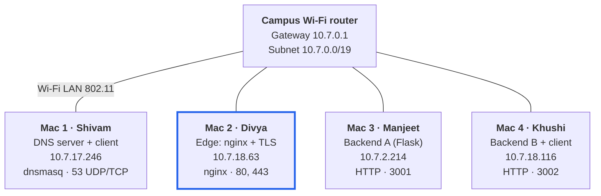
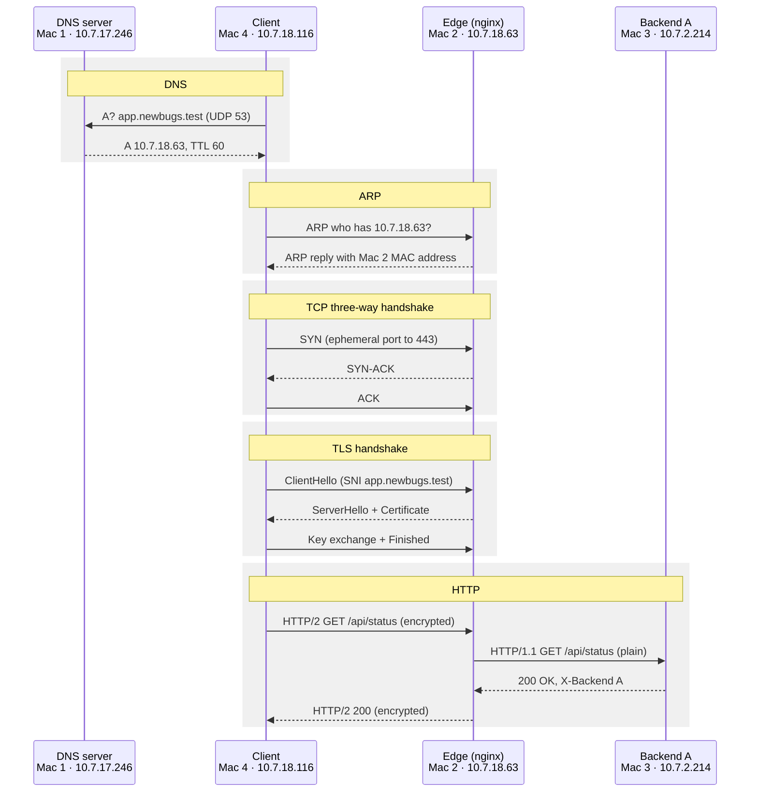

# Newbugs CN Project: Architecture Document

Computer Networks course project · Private Network Service Platform · Phase 1

## 1. Overview

Team **Newbugs** (Shivam, Divya, Manjeet, Khushi) built a private service platform on four MacBooks connected to one Wi-Fi LAN, with no cloud services. A client types `https://app.newbugs.test`; the name is resolved by our own DNS server, the HTTPS connection terminates at our own nginx edge, and the request is load-balanced across two backend servers.

The application is deliberately simple: a small Flask REST API that returns JSON. The network path is the project.

| Item | Value |
| --- | --- |
| Private domain | `newbugs.test` (reserved `.test` namespace, not `.local`) |
| Service names | `app.newbugs.test`, `api.newbugs.test` |
| Network | Campus Wi-Fi, subnet 10.7.0.0/19, gateway 10.7.0.1 |
| Phase 1 status | All build tasks A–G and failure demos F1–F5 completed and evidenced |

## 2. Network topology

*Mac 2 (highlighted) is the single entry point. Backends on 3001 and 3002 are reached only by nginx on Mac 2; DNS on Mac 1 answers both client Macs.*

All four Macs sit on the same Layer 2 segment of the campus Wi-Fi, so they reach each other directly with no router hop in between (ping replies arrive with TTL 64, the macOS starting value). Mac 2 is the only entry point for clients: it holds the TLS certificate and is the only machine that talks to the backends.

Addresses come from campus DHCP and can change between sessions. Each Mac's Private Wi-Fi Address was turned off so its hardware MAC, and therefore its lease, stays stable. At the start of every session all four IPs are checked with `ipconfig getifaddr en0`; if one changes, the dnsmasq records (Mac 2's IP) or the nginx upstream (backend IPs) are updated.

## 3. Machine roles and IP/service inventory

| Machine | Owner | Role | IPv4 | Hardware MAC | Interface | Services and ports | Cloud equivalent |
| --- | --- | --- | --- | --- | --- | --- | --- |
| Mac 1 | Shivam | Private DNS server + test client | 10.7.17.246 | 10:9f:41:b0:10:7c | en0 | dnsmasq on 53/UDP and 53/TCP | AWS Route 53 (private hosted zone) |
| Mac 2 | Divya | Edge: reverse proxy, TLS termination, load balancer | 10.7.18.63 | 10:9f:41:bf:b4:79 | en0 | nginx on 80/TCP (redirect) and 443/TCP (HTTPS, HTTP/2) | AWS Application Load Balancer / CDN edge |
| Mac 3 | Manjeet | Backend A | 10.7.2.214 | 50:a6:d8:ac:36:ad | en0 | Flask REST API on 3001/TCP | EC2 instance in a target group |
| Mac 4 | Khushi | Backend B + test client | 10.7.18.116 | 10:9f:41:bd:58:a9 | en0 | Flask REST API on 3002/TCP | EC2 instance in a target group |

All Macs: subnet mask 255.255.224.0 (/19), default gateway 10.7.0.1. Client Macs (Mac 1 and Mac 4) use Mac 1 as their DNS resolver: Mac 1 points at 127.0.0.1, Mac 4 at 10.7.17.246.

### Service map

| Name or address | Answered by | Purpose |
| --- | --- | --- |
| `app.newbugs.test` → 10.7.18.63 | dnsmasq on Mac 1 | Main service name used by clients |
| `api.newbugs.test` → 10.7.18.63 | dnsmasq on Mac 1 | Second name on the same edge (same certificate via SAN) |
| `https://app.newbugs.test` | nginx on Mac 2 | Single public entry point |
| `http://10.7.2.214:3001` | Backend A | Reached only by nginx |
| `http://10.7.18.116:3002` | Backend B | Reached only by nginx |

## 4. Request flow

*The next request takes the same path, but nginx round robin sends it to Backend B (Mac 4, port 3002).*

The client never knows a backend IP. DNS returns only the edge's address; nginx owns the list of backends and picks one per request. TLS terminates at nginx, so the client-to-edge hop is encrypted (HTTP/2 over TLS) and the edge-to-backend hop is plain HTTP/1.1 on the private LAN. nginx adds `X-Real-IP` and `X-Forwarded-For` so the backend still learns the original client address.

This exact sequence is captured in `capture1-client-full.pcapng` (client side, Wi-Fi + loopback) and `capture2-edge-to-backend.pcapng` (edge side, plain HTTP).

## 5. Protocol layers and ports

| Protocol | Role in one request | TCP/IP layer | OSI layer | Ports / addresses | Evidence |
| --- | --- | --- | --- | --- | --- |
| DNS | Resolves `app.newbugs.test` to 10.7.18.63 | Application | 7 Application | Client ephemeral port → 53/UDP (TCP 53 for large answers) | `B-dns/`, `G1-dns.png` |
| HTTP/2 | Client request and response, inside TLS | Application | 7 Application | Inside the 443 connection | `E-tls/`, curl `-v` output |
| HTTP/1.1 | nginx to backend, plain text | Application | 7 Application | nginx ephemeral port → 3001 / 3002 | `G6-edge-to-backend-plain-http.png` |
| TLS 1.2 / 1.3 | Encrypts client to edge, proves server identity with the certificate | Between application and transport | 5 Session / 6 Presentation | Runs on the 443 TCP connection | `G4-tls-handshake.png` |
| TCP | Reliable, ordered connection; three-way handshake, Seq/Ack, flow control window | Transport | 4 Transport | Client ephemeral (e.g. 62416) → 443 | `G3-tcp-3way.png`, `G5-tcp-retransmission.png` |
| UDP | Carries DNS queries without a connection | Transport | 4 Transport | Ephemeral → 53 | `G1-dns.png` |
| IP (IPv4) | Addresses each Mac on 10.7.0.0/19 | Internet | 3 Network | 10.7.17.246, 10.7.18.63, 10.7.2.214, 10.7.18.116 | Every capture |
| ARP | Maps 10.7.18.63 to Mac 2's hardware MAC before the first frame | Link | 2 Data link | Broadcast on the LAN | `G2-arp.png` |
| Wi-Fi (802.11) | Physical delivery of frames to the access point | Link | 1 Physical / 2 Data link | en0 on every Mac | Interface inventory |

Ephemeral ports are chosen by the client operating system (49152–65535 on macOS); well-known ports (53, 80, 443) identify the service. A socket pair is (source IP, source port, destination IP, destination port, protocol), for example (10.7.17.246, 62416, 10.7.18.63, 443, TCP).

In TLS 1.3 the Certificate message is encrypted, so Wireshark shows it only in the TLS 1.2 capture. Both captures are kept for comparison.

## 6. Service configuration

Full config files are in this repo: `dns/dnsmasq.conf`, `edge/newbugs.conf`, `backend/app.py`. Private keys are not committed.

### DNS (Mac 1, dnsmasq)

| Setting | Value | Why |
| --- | --- | --- |
| Records | `host-record=app.newbugs.test,10.7.18.63` and the same for `api` | Exact A records, like Route 53 records (not wildcard `address=`) |
| TTL | `local-ttl=60` | Answers carry a 60 s TTL, visible in `dig`; used in the Phase 2 TTL demo |
| Private zone | `local=/newbugs.test/` | Unknown names in our zone return NXDOMAIN and never leak to public DNS |
| Upstreams | `no-resolv`, `server=1.1.1.1`, `server=8.8.8.8` | Every other name is forwarded, so clients keep normal internet access |
| Listening | `interface=en0`, `interface=lo0` | Answers LAN clients and Mac 1 itself; restart after a DHCP change |
| Logging | `log-queries` to `/tmp/dnsmasq.log` | Shows each query, its source IP and whether it was answered from config, cache or upstream |

### Edge (Mac 2, nginx)

| Setting | Value | Why |
| --- | --- | --- |
| Upstream pool | Backend A `10.7.2.214:3001`, Backend B `10.7.18.116:3002` | nginx owns the backend list; clients never see it |
| Strategy | Round robin (default) | Requests alternate A, B, A, B |
| Passive health check | `max_fails=2 fail_timeout=10s` | After 2 failed connects a backend is skipped for 10 s |
| Retry | `proxy_next_upstream error timeout http_502 http_503` | A failed request is retried on the other backend, so the user still gets 200 |
| Connect timeout | `proxy_connect_timeout 2s` | Fails fast when a backend is down |
| Port 80 | `return 301 https://…` | Plain HTTP is redirected to HTTPS |
| Port 443 | `listen 443 ssl` + `http2 on`, TLS 1.2 and 1.3 | TLS termination and HTTP/2 for clients |
| Headers added | `X-Real-IP`, `X-Forwarded-For`, `X-Forwarded-Proto`, `X-Edge: mac2-nginx` | Backend learns the real client; responses show they passed the edge |
| Logging | `upstream=$upstream_addr up_status=$upstream_status` | Server-side proof of load balancing and retries |

### TLS certificate

| Item | Value |
| --- | --- |
| Approach | Own local CA made with OpenSSL 3, which signs the server certificate |
| CA | `CN=Newbugs Local CA`, RSA 4096, valid 1 year; key stays on Mac 2 only |
| Server certificate | `CN=app.newbugs.test`, RSA 2048, SAN `app.newbugs.test` and `api.newbugs.test`, valid to Oct 2027 |
| Client trust | `newbugs-ca.crt` added to the System keychain on Mac 1 and Mac 4; curl and browsers validate with no `-k` |

### Backends (Mac 3 and Mac 4, Flask)

The same `app.py` runs on both; only `BACKEND_ID` and `PORT` differ. Both bind to `0.0.0.0` so nginx can reach them over the LAN (`lsof` shows `*:3001` and `*:3002`).

| Endpoint | Response | Headers | Purpose |
| --- | --- | --- | --- |
| `GET /` | JSON: service, backend, host | `X-Backend` | Service running page |
| `GET /api/status` | `{"backend":"A","status":"ok"}` | `X-Backend`, `Cache-Control: no-store` | Load-balancing proof; never cached |
| `GET /api/catalog` | Fixed JSON, identical on both backends | `X-Backend`, `Cache-Control: public, max-age=60`, `ETag` | Caching demo: fresh hit and 304 |

### Caching behaviour

| Type | Reaches server? | Body sent? | Seen as |
| --- | --- | --- | --- |
| Fresh cache hit | No | No | Browser: "(disk cache)", 0 B transferred; nothing in the backend log |
| Conditional request | Yes, with `If-None-Match` | No | `304 Not Modified` in curl, browser and backend log |
| Full new request | Yes | Yes | `200` with the full JSON |

Because the catalog data is identical on both backends, the ETag (`"e946e9046cad3704"`) is the same whichever backend answers, so a 304 works across the load balancer.

## 7. Failure scenarios tested (Phase 1)

Each test broke one layer on purpose while the others kept working.

| # | Failure | Lead | What we observed | Layer that failed | What it shows |
| --- | --- | --- | --- | --- | --- |
| F1 | Client DNS set to 8.8.8.8 | Khushi | `dig` → NXDOMAIN from 8.8.8.8, curl exit code 6; ping to 10.7.18.63 still worked, and curl with `--resolve` returned 200 | DNS | Name resolution and IP connectivity are independent |
| F2 | `app` record changed to 10.7.2.214 | Shivam | `dig` returned 10.7.2.214 with no error, ping replied, but TCP to port 443 was refused | TCP (wrong destination) | DNS is a directory, not a connection |
| F3 | Backend A stopped | Manjeet | All requests still 200, all `X-Backend: B`; nginx logged `Connection refused` then `upstream server temporarily disabled` | Backend A only | Passive health check and retry keep the service up |
| F4 | Both backends stopped | Divya | DNS, TCP and TLS succeeded (`SSL certificate verify ok`), then `HTTP/2 502`; nginx tried B, then A, both refused | Application (behind the edge) | The 502 comes from nginx: the edge works, nothing behind it answers |
| F5 | Client connects to port 9443 | Khushi | Ping and port 443 worked; port 9443 got SYN → RST, ACK in Wireshark | TCP (no listener on that port) | IP finds the machine, the port finds the program |

Incidental findings during testing were also kept as evidence: a TCP spurious retransmission and duplicate ACK on the busy Wi-Fi, an nginx retry log line (`up_status=504, 200`) when a backend was briefly unreachable, and raw TLS ClientHello bytes in a backend log when HTTPS was sent to a plain HTTP port.

### Diagnosis order

The same order is used for any fault: name resolution (`dig`), then TCP reachability (`ping`, `nc -vz host 443`), then TLS (`curl -v` handshake lines), then the application (HTTP status code and the nginx error log).

## 8. Design decisions and known limitations

### Decisions

| Decision | Reason |
| --- | --- |
| `.test` domain, not `.local` | macOS sends `.local` names to mDNS (Bonjour, port 5353), so our DNS server would never be asked |
| dnsmasq binds by interface, not by fixed IP | Campus DHCP can change Mac 1's address; binding by interface keeps the config valid |
| Own local CA instead of a single self-signed certificate | Mirrors real HTTPS trust: clients trust the CA, the CA vouches for the server, and new server certificates need no new client setup |
| TLS terminated at nginx | One place holds the certificate and private key; backends stay simple plain-HTTP apps |
| Round robin load balancing | Equal backends with equal work; alternation makes the balancing visible in `X-Backend` |
| `/api/status` set to `no-store` | Stops browsers caching it, so load balancing stays visible on every request |
| Identical catalog data on both backends | Gives the same ETag on both, so 304 revalidation works behind the load balancer |

### Known limitations

| Limitation | Effect | Plan |
| --- | --- | --- |
| Campus DHCP addresses | IPs can change between sessions and break records and the upstream list | Recheck IPs each session; personal router preferred for demo day |
| Busy shared Wi-Fi | Latency spikes (pings up to about 160 ms) caused occasional connect timeouts to a backend, absorbed by nginx retries | Keep backend Macs awake and charging; connect timeout can be raised to 5 s |
| Single DNS server (Mac 1) | If Mac 1 sleeps, clients lose all name resolution | Phase 2 Extension A: backup DNS resolver |
| Single edge (Mac 2) | nginx is a single point of failure | Phase 2 Extension E: standby edge with DNS-based cutover |
| Backends reachable directly on 3001/3002 | Clients could bypass the edge | Phase 2 Extension C: firewall rules so only Mac 2 reaches the backends |
| Passive health checks only | Open-source nginx detects failures from real requests, not by probing | Acceptable for this project; active checks are an nginx Plus feature |
